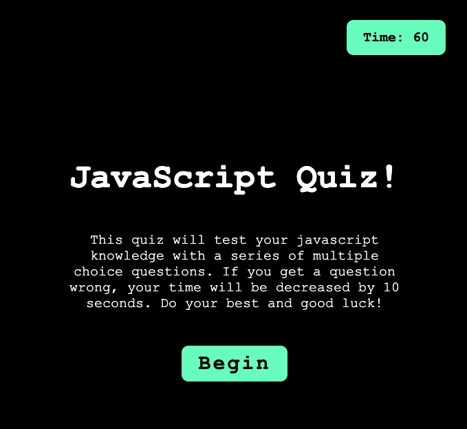

# javascript-quiz

## Description 

For this project, although it has a simple design, it was my first time implementing javascript to increase
the functionality of a website. It is a simple multiplce choice javascript quiz that saves your score locally to the browser once finished. It also features a timer, and a lot of logic. Here I learned how the DOM interacts with javascript and the all the key components to having html elements invoke events with .addEventListener.

 

Here is the link to the deployed website: 
 
[Click Here for link](https://lopez-jordan.github.io/javascript-quiz/)

© 2023 edX Boot Camps LLC. Confidential and Proprietary. All Rights Reserved.